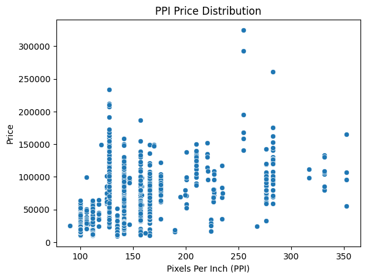
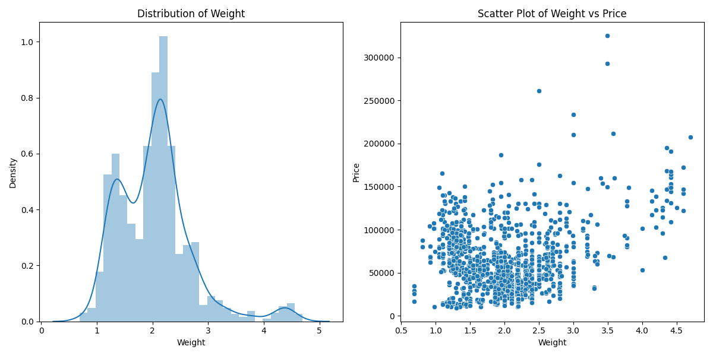
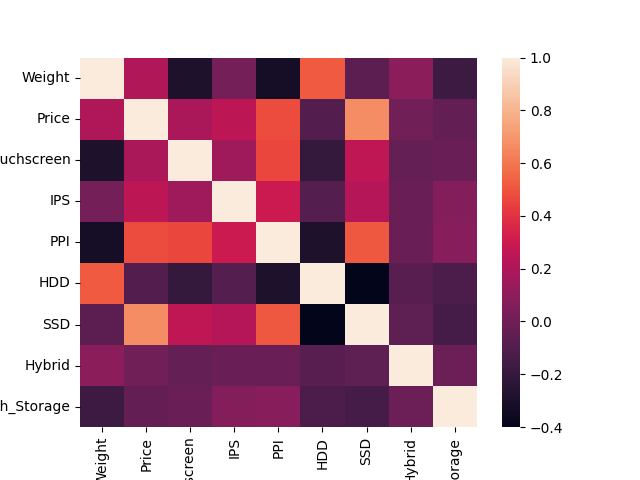
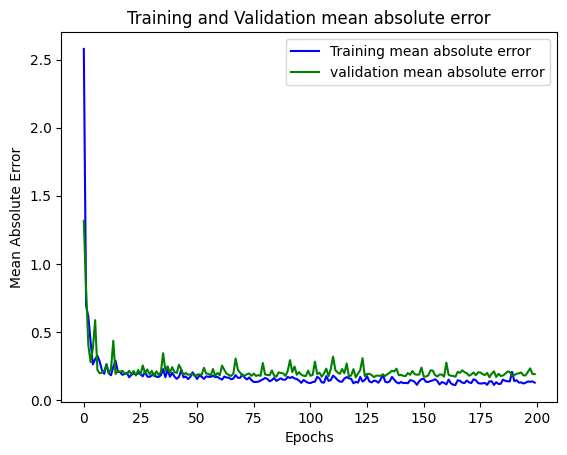
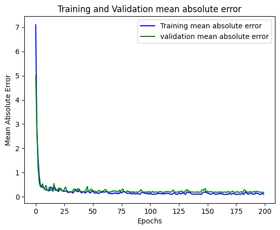

# Laptop Price Prediction

This project aims to predict laptop prices using machine kearning and deep learning models. The dataset used in this project contains various features of laptop, including both categorical and numerical variables. It uses different ML and DL models for the task, then chooses the best model based on the accuracy scores.

## **DESCRIPTION**

There are 11 features and 1304 entries in this dataset. The different features available in this dataset are :-

- **`Company`** - The Company which makes this Laptop
- **`TypeName`** - The type of laptop, e.g., Ultrabook, Notebook, Gaming, etc.
- **`Inches`** - The size/width of the laptop in inches.
- **`ScreenResolution`** - The type of screen of the laptop, e.g., IPS, HD, FHD, etc, whether it is touchscreen or not, and the resolution of the screen in pixels.
- **`Cpu`** - Corresponds to the type of processor present in the laptop.
- **`Ram`** - COrresponds to the size of the RAM in the laptop.
- **`Memory`** - Corresponds to the type and size of the memory present in the laptop.
- **`Gpu`** - Corresponds to the brand and type of GPU present in the laptop.
- **`OpSys`** - The type of operating system present in the laptop, e.g., Windows, MacOS, Linux, etc.
- **`Weight`** - The weight of the laptop in kgs.
- **`Price`** - The price of the laptop in INR.

## **WHAT I HAVE DONE**

* First I imported all the required libraries and dataset for this project.
* Performed some EDA on the whole dataset.
* Removing the units from RAM and Weight column.
* Analysing each and every column individually and preparing visualization about its impact on the target variable.
* Removing the unnecessary variables.
* Performing one hot encoding on object features and converting them into integer datatype.
* Visualizing the dataset distribution in univariate and bivariate with target feature.
* Watching the correlation of different features by plotting Heatmap.
* Keep the necessary features for further processing and splitting the dataset into training and testing set.
* Then, i have developed multiple machine learning models and calculated their error and score.
* Then, i have developed ANN and RNN deep learning models and predicted their score which is better than the machine learning algorithms and fit the dataset properly.
* Finally plotting the graph of visualizing how the model is reducing the mean absolute error with every epoch.

## **MODELS USED**

**Machine Learning models :-**

1. Simple Linear Regression
2. Support Vector Machine (SVM) Regression
3. Decision Tree Regression
4. Random Forest Regression
5. XG Boost Regression

**Deep Learning models :-**

1. Artificial Neural Network (ANN)
    - Architecture:
      - Input layer - Consists of the encoded and scaled values of the X datset (independent features)
      - Hidden layers - Consists of a total of 8 layers 
        - Hidden Layer 1 - 44 neurons, Activation Function - relu
        - Hidden Layer 1 - 48 neurons, Activation Function - relu
        - Hidden Layer 1 - 60 neurons, Activation Function - relu
        - Hidden Layer 1 - 52 neurons, Activation Function - relu
        - Hidden Layer 1 - 44 neurons, Activation Function - relu
        - Hidden Layer 1 - 8 neurons, Activation Function - relu
        - Hidden Layer 1 - 36 neurons, Activation Function - relu
        - Hidden Layer 1 - 40 neurons, Activation Function - relu
      - Output Layer - consists of a single neuron with a linear activation function which is the predicted price of the laptop
    - Activation Function: Rectified Linear Unit(ReLU) for hidden layers and linear for the output layer
    - Optimizer: Adam Optimizer with learning rate as 0.01
    - Loss Function: Mean Squared Error
    

2. Recurrent Neural Network (RNN)
    - Architecture:
      - Input layer - Consists of the encoded and scaled values of the X datset (independent features)
      - Hidden layers - Consists of a total of 8 layers 
        - Hidden Layer 1 - 44 neurons, Activation Function - relu
        - Hidden Layer 1 - 48 neurons, Activation Function - relu
        - Hidden Layer 1 - 60 neurons, Activation Function - relu
        - Hidden Layer 1 - 52 neurons, Activation Function - relu
        - Hidden Layer 1 - 44 neurons, Activation Function - relu
        - Hidden Layer 1 - 8 neurons, Activation Function - relu
        - Hidden Layer 1 - 36 neurons, Activation Function - relu
        - Hidden Layer 1 - 40 neurons, Activation Function - relu
      - Output Layer - consists of a single neuron with a linear activation function which is the predicted price of the laptop
    - Activation Function: Rectified Linear Unit(ReLU) for hidden layers and linear for the output layer
    - Optimizer: Adam Optimizer with learning rate as 0.01
    - Loss Function: Mean Squared Error

## **LIBRARIES NEEDED**

* numpy
* pandas
* seaborn
* matplotlib
* scikit-learn
* xgboost
* tensorflow

## Data Visualization

**Univariate Analysis of Companies with the Price of the Laptop**

**Univariate Analysis of Laptop Screen Display Type with the Price of the Laptop**

**Univariate Analysis of the GPU Brand with the Price of the Laptop**

**Univariate Analysis of the Operating System with the Price of the Laptop**

**Univariate Analysis of the Processor Brand with the Price of the Laptop**

**Univariate Analysis of the RAM Size with the Price of the Laptop**

**Univariate Analysis of the Type of the Laptop with the Price of the Laptop**

**Univariate Analysis of the Screen resolution with the Price of the Laptop**

**Univariate Analysis of the PPI(Pixels per Inches) with the Price of the Laptop**

**Univariate Analysis of the Touchscreen property of the Laptop with the Price of the Laptop**

**Univariate Analysis of the Weight of the Laptop with the Price of the Laptop**

**Correlation heatmap of the features**

**Performance of the ANN model**

 

**Performance of the RNN model**

## Results

| Model                             | MAE                     | R-squared score        |
|-----------------------------------|-------------------------|------------------------|
| Simple Linear Regression          | 0.21039621214199625     | 0.8304095218877641     |
| SVM Regression                    | 0.20729298482338832     | 0.7370300583137905     |
| Decision TRee Rregreesion         | 0.19755240083425513     | 0.8381524655064068     |
| Random Forest Regression          | 0.16548542230348626     | 0.8822151183695824     |
| XG Boost Regression               | 0.17102617851984125     | 0.8852917715436597     |
| Artificial Neural Network (ANN)   | 0.19527859127734548     | 0.8480962103634869     |
| Recurrent Neural Network (RNN)    | 0.17796419696429638     | 0.8617719589519217     |

## Conclusions
As the results show, based on the lowest MAE or Higest R-Squared value, XG Boost Regressiom is the best model among all the Machine Learning Models.
As the results show, based on the lowest MAE or Higest R-Squared value, Recurrent Neural Network is the best model among all the Deep Learning Models.
