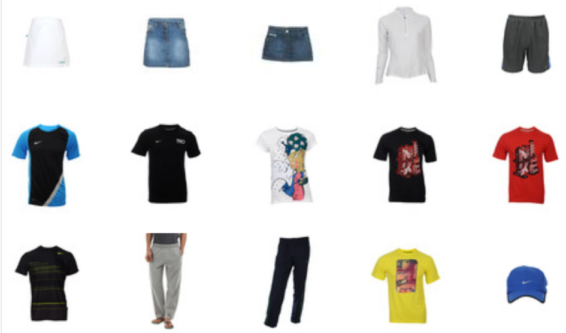

---

# Myntra Fashion Product Analysis

## 🎯 Goal

The primary objective of this project is to perform image classification to predict category of myntra products as well as leveraging pre-trained models such as VGG19, ResNet50, InceptionV3, and Mobilenet. These models are trained to categorize images into classes, offering a versatile solution for various image processing tasks.

## 🖼️ Dataset

The dataset used for this project comprises images scattered across different types,categories,etc. As the original dataset allocated for this project was too heavy to be utilised for scope of this project,an alternative dataset was utilized.

**Dataset Link**: 
https://www.kaggle.com/datasets/paramaggarwal/fashion-product-images-small/data

## 🧾 Description

This project utilizes a VGG19, ResNet50, InceptionV3, and Mobilenet for image classification. The chosen model are tailored to capture specific features of the dataset and models leverage transfer learning, enhancing the model's ability to generalize across diverse images.

## 🧮 What I Had Done

1. **Data Preprocessing**:
   - Resizing images to match the input size of the models (e.g.,96x96 pixels).
   - Normalization of pixel values to the range [0, 1].
   - Refering to dataset to find different paramters
   - Choosing Subcategory for prediction which has 36 classes like footwear,innerwear,topwear,etc

2. **Model Architectures**:
   - VGG19: Leveraging the pre-trained VGG19 architecture.
   - ResNet50: Utilizing the pre-trained ResNet50 architecture.
   - InceptionV3: Utilizing the pretrained model with version V3.
   - MobileNetV2: Leveraging the powerful mobilenet model.

3. **Model Training**:
   - Training the models over the image dataset across 36 different classes
   - Evaluating the models on the validation set to monitor performance.

4. **Save Models**:
   Saving the trained models for future use and predictions.

## 📚 Libraries Needed

1. TensorFlow
2. Matplotlib
3. Numpy
4. Scikit-learn 

## 📊 Visualization Results

### Image sample plot

### Dataset Distribution

## 📈 Model Performance based on Accuracy Scores

| Model           | Accuracy |
|-----------------|----------|
| MobilenetV2     | 89.8     |
| ResNet50        | 87.9     |
| InceptionV3     | 38       |
| VGG19           | 88.4     |

## 📢 Conclusion And Result

The image classification project using different models demonstrates effective learning and categorization across 36 classes. The models achieve promising accuracy on both training and validation sets, showcasing their potential for various image processing applications. Our MobileNetV2 scored the highest with 89.8% accuracy, while Inception scored the lowest with 38%.

✒️Your Signature  
  Keshav Arora

--- 
